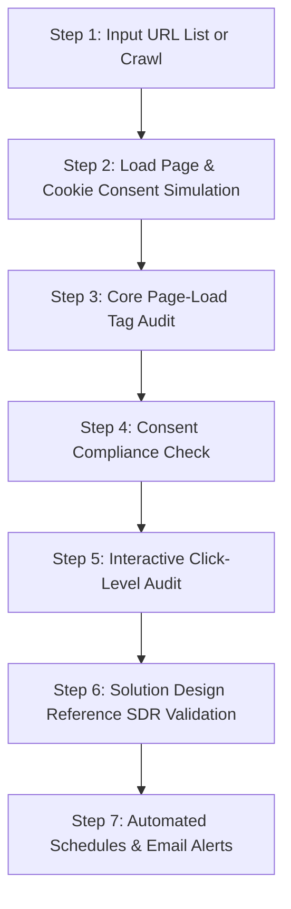

# Tag Validator Pro — Client Pitch & Product Overview

This document is designed to help you pitch and explain the **Tag Validator Pro** product to clients. It covers the core problems it solves, the exact time and cost savings it delivers, a step-by-step guide of its features, and the difference between the core automation tool and the AI assistant.

---

## 1. Executive Summary: Why Do We Use This Product?

Every modern business relies on tracking tags (like Google Tag Manager, Google Analytics 4, Adobe Analytics, Tealium) and advertising pixels (Meta/Facebook, Google Ads, TikTok, LinkedIn) to run marketing campaigns and understand customer behavior. 

However, managing these tags creates two massive challenges:

1. **Consent Compliance (GDPR, CCPA, ePrivacy)**: If an advertising pixel fires *before* a user accepts cookies or *after* they select "Reject All", the company can face massive legal fines and reputational damage.
2. **Data Brokenness (QA Overhead)**: If tags are missing, duplicated, or misconfigured, marketing budgets are wasted on wrong data, and analytics dashboards display incorrect metrics.

### The Problem with Manual QA
Normally, verifying that tracking tags work across 100+ pages under different cookie consent options is done manually by QA engineers. A human tester has to:
* Clear browser history/cookies.
* Load a webpage.
* Open the browser console/Developer Tools.
* Search through hundreds of network requests for specific tracking codes.
* Click consent buttons, reload, and verify that the tags changed their firing behavior.

This takes **15 to 20 minutes per webpage**, is highly repetitive, and is prone to human error.

### The Solution: Tag Validator Pro
**Tag Validator Pro** is an automated auditing system that drives a headless Chrome browser to act like a real user. It automatically clicks cookie banners, navigates links, scans all network requests at a code level, extracts tracking IDs, checks tags under various consent levels, and outputs a clean, ready-to-share Excel report in minutes.

---

## 2. ROI & Time Savings: How Much Time Are We Saving?

Here is a side-by-side comparison of manual QA versus using **Tag Validator Pro**:

| Metric | Manual Verification | Tag Validator Pro | Time Saved / Improvement |
| :--- | :--- | :--- | :--- |
| **Time per Webpage** | ~15 - 20 minutes | **~15 - 20 seconds** | **98.8% faster** |
| **Audit of 50 URLs** | 12.5 hours (1.5 working days) | **12 - 15 minutes** | Save over **12 hours** of manual labor |
| **Audit of 500 URLs** | 125 hours (15 working days) | **2.5 hours** (runs in background) | Save **122+ hours** of labor |
| **Verification Depth** | Usually checks basic page load tags only | Checks **5 consent scenarios** + **clicks every button/link** + **validates parameters** | Far deeper, 100% accurate coverage |
| **Human Error** | High (missing pixels, wrong IDs, typos) | **Zero** (automated API request scanning) | Standardized, structured reports |

---

## 3. Step-by-Step Feature Walkthrough (How the Tool Works)

The product operates in a logical, step-by-step pipeline designed to take zero configuration from the client:

### Step 1: Input URL List or Auto-Crawl
* **Excel Upload**: You upload a simple list of URLs in an Excel file.
* **Smart Domain Crawling**: If the client doesn't have a sitemaps/URLs list, the built-in crawler automatically visits the homepage and extracts all internal links, compiling a clean list for auditing.

### Step 2: Cookie Consent Simulation (OneTrust & CMPs)
* Instead of slow UI clicking, the tool directly injects OneTrust cookie categories (C0001 to C0005) into the browser context.
* For custom banners, it automatically identifies and clicks the "Accept All" or "Reject All" buttons.

### Step 3: Core Page-Load Tag Audit
The tool loads the page and monitors the network requests at the Chrome DevTools Protocol (CDP) level. It identifies:
* **Tag Management Systems**: Tealium IQ, Adobe Experience Platform (Launch), Google Tag Manager (GTM).
* **Analytics Systems**: Google Analytics 4 (GA4), Adobe Analytics (AppMeasurement / Web SDK).

### Step 4: Consent Compliance Check (The Privacy Audit)
The browser reloads the page under **5 different scenarios**:
1. **Accept All**: Grants full consent. All marketing pixels should fire.
2. **Reject All**: Denies all tracking. **No marketing pixels must fire.** If a pixel fires here, the tool flags a **Compliance FAIL**.
3. **Performance Only**: Only analytics pixels should fire.
4. **Functional Only**: Only functional tools should fire.
5. **Targeting Only**: Social media and retargeting pixels (Meta, TikTok) are allowed.

### Step 5: Interactive Click-Level Audit (Deep QA)
Most tracking tags fire when users interact with the page (e.g., clicking "Add to Cart", "Apply Now", header dropdowns).
* The tool automatically scans the webpage DOM to find every interactive link, button, hamburger menu, and collapsible container.
* It hovers over menus to reveal hidden sub-menus, clicks every interactive element, and monitors which click-level events (like GA4 custom events or Adobe `s.tl` calls) fire.

### Step 6: SDR (Solution Design Reference) Validation
Large companies have an **SDR Excel Sheet** that lists:
* "When button X is clicked, GA4 event `select_promotion` must fire with parameter `promo_name='spring_sale'`."
* The tool reads this SDR document, navigates to the page, finds the element, clicks it, and compares the fired parameters against the excel specifications. It generates a detailed **PASS/FAIL** report with a parameter-level diff.

### Step 7: Automated Schedules & Email Alerts
You can schedule audits (e.g., run every Monday at 8 AM). After completion, the tool uses the **Brevo API** (working over secure HTTPS:443 to bypass cloud firewalls) to email a summary and the result Excel sheet to all stakeholders.

---

## 4. The Difference: AI Bot vs. Core Tool

It is important to explain to the client that this product contains two distinct, powerful components:

| Feature / Aspect | The Core Automation Tool | The Integrated AI Bot |
| :--- | :--- | :--- |
| **What it is** | The execution engine (Playwright, Python, Node.js). | The cognitive brain (Large Language Model integration). |
| **Responsibility** | Performs the heavy lifting: crawling sites, executing clicks, recording HTTP requests, evaluating scenarios. | Analyzes the results, writes custom code, diagnoses failures, and answers questions. |
| **How it interacts** | Takes inputs (Excel/Settings) and generates outputs (Excel/JSON files). | Takes natural language prompts (e.g., *"Why did Meta Pixel fail on Page X?"*) and explains it. |
| **Use Case** | Run weekly compliance checks and export Excel sheets for developers. | Ask: *"Compare this week's audit with last week's and list which pages dropped tracking."* |

### Example Analogy:
* **The Core Tool** is the automated diagnostic equipment in a clinic (it runs the blood tests, scans, and outputs raw charts).
* **The AI Bot** is the expert specialist doctor who reads the charts, explains what is wrong in plain English, and suggests the exact prescription/fix to the developers.

---

## 5. Client Presentation Script (Hinglish / Hindi Guide)
*Use this cheat sheet to explain the tool verbally to your client:*

> *"Sir/Ma'am, standard manual testing me humare QA engineers ko ek-ek page open karke, browser ke console me jaakar, cookies reset karke check karna padta hai ki Facebook pixel ya Google Analytics correct code fire kar raha hai ya nahi. Isme ek page check karne me **15 se 20 minutes** lagte hain, aur 100 pages ke liye **do se teen din** ka manual work lag jata hai.*
>
> *Humne jo **Tag Validator Pro** develop kiya hai, ye is pure process ko **completely automate** kar deta hai. 
> 
> * **Time Savings**: Ye tool ek page ko check karne me sirf **15-20 seconds** leta hai. Jo kaam 2 din me hota tha, wo ab **15 minutes** me ho jata hai, aur report seedhe Excel format me download ho jati hai.
> * **Features**: Ye tool page load tags hi nahi, balki **Cookie Consent Compliance** (Reject All par pixels block ho rahe hain ya nahi) aur **Click-Level events** (Add to Cart, Menu Clicks par trigger hone wale events) ko bhi verify karta hai. Aur agar aapke paas client ka **SDR (Solution Design Reference) Excel Sheet** hai, toh ye automatically us sheet se matching checks karke parameters ka PASS/FAIL check kar deta hai.
> * **AI Bot vs Tool**: Tool background me automated browser run karke raw network data aur report generate karta hai, aur isme integrated humara **AI Bot** us data ko analyze karke developers ko clear points me batata hai ki kaunsa tracking code kaha tuta hai aur usse kaise fix karna hai."*

---

## 6. How to View / Download this Document
1. This presentation is saved in your workspace root as `Tag_Validator_Client_Pitch.md`.
2. A beautiful interactive HTML version has been deployed to the Web server. Once the server is running, you can access it directly at:
   `http://localhost:4000/pitch.html`
3. To download it as a **PDF**, open `http://localhost:4000/pitch.html` in Chrome, press **Ctrl + P** (Print), and select **"Save as PDF"**.
